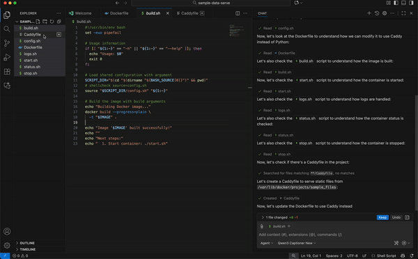

# Qwen3-Omni vLLM Docker

Super-simple docker container setup for running Qwen3-Omni models (Instruct, Thinking, Captioner) using a custom version of vLLM with Qwen patches and flash attention.

NOTE: This has tiny optimizations for H200. Just fork this repo, clone, and modify the `./start.sh` script to add/modify/remove vLLM args as needed.

## Supported Models

- **instruct** (default): `Qwen/Qwen3-Omni-30B-A3B-Instruct`
- **thinking**: `Qwen/Qwen3-Omni-30B-A3B-Thinking` 
- **captioner**: `Qwen/Qwen3-Omni-30B-A3B-Captioner`

## Supports OpenAI-compatible API - works with VSCode Copilot Insiders



## Quick Start

1. **Make scripts executable**:
   ```bash
   make setup
   ```

2. **Build the Docker image** (defaults to instruct):

  Please note: The size of the base image is substantial due to a full CUDA toolkit installation. Ensure you have sufficient disk space - all layers take ~16GiB.
  A fresh build (without cache) may take 15-30 minutes depending on your internet speed and system performance.

   ```bash
   sudo make build
   # or specify variant: make build MODEL_VARIANT=thinking
   ```

3. **Download the model** (optional, can use HF cache):
   ```bash
   make download
   # or specify variant: make download MODEL_VARIANT=thinking
   ```

   Example output:

```bash
./download.sh instruct
Setting up Python virtual environment in: .venv...
=== Hugging Face download configuration ===
  MODEL_VARIANT:           instruct
  MODEL_REPO:              Qwen/Qwen3-Omni-30B-A3B-Instruct
  HF_HOME:                 /var/lib/docker/container_volumes/hf_models
  TRANSFORMERS_CACHE:      /var/lib/docker/container_volumes/hf_models
  HUGGINGFACE_HUB_CACHE:   /var/lib/docker/container_volumes/hf_models
  Effective HF hub cache:  /var/lib/docker/container_volumes/hf_models
  Target materialization:  HF cache (internal hashed layout)
===========================================
Proceed with download? [y/N]
```

4. **Start the container**:
   ```bash
   make start
   # or specify variant: make start MODEL_VARIANT=thinking
   ```

5. **Check status**:
   ```bash
   make status
   # or specify variant: make status MODEL_VARIANT=thinking
   ```

Example output:

```bash
./status.sh instruct
=== Docker Container Status ===
  Container name: qwen3-omni-30b-a3b-instruct
  Expected image: qwen3-omni-vllm:instruct
  Expected port:  8901
  Model variant:  instruct
  Model repo:     Qwen/Qwen3-Omni-30B-A3B-Instruct
===============================

📋 Container Information:
  Status:     running
  Image:      qwen3-omni-vllm:instruct
  Created:    2025-09-24
  ✅ Container is running
  Started:    2025-09-24
  Port map:   8901/tcp -> 0.0.0.0:8901
8901/tcp -> [::]:8901

🌐 API Access:
  Endpoint:   http://localhost:8901
  Health:     http://localhost:8901/health

📊 Quick Actions:
  View logs:  docker logs -f qwen3-omni-30b-a3b-instruct
  Stop:       ./stop.sh instruct

🔍 Connectivity Test:
  ✅ API is responding on port 8901

📈 Resource Usage:
  CPU:        0.72%     4.002GiB / 503.4GiB
  Memory:     0.72%     4.002GiB / 503.4GiB
```

6. **Stop the container**:
   ```bash
   make stop
   # or specify variant: make stop MODEL_VARIANT=thinking
   ```

7. **Test vLLM and Model (e2e test using cURL)**:
   ```bash
   make test-api
   # or specify variant: make test-api MODEL_VARIANT=thinking
   ```

## Model Variant Usage

### Method 1: Make with Arguments (Recommended)
```bash
# Build specific variant
make build thinking
```

### Method 2: Direct Script Arguments
```bash
make setup  # make scripts executable

# Use scripts with arguments
./build.sh thinking
```
### Method 3: Environment Variable
```bash
# Set variant for all subsequent commands
export MODEL_VARIANT=thinking
make build
```

## Make Commands

- `make help` - Show all available commands and examples
- `make setup` - Make scripts executable
- `make build [MODEL_VARIANT=x]` - Build Docker image for variant
- `make download [MODEL_VARIANT=x]` - Download model files
- `make start [MODEL_VARIANT=x]` - Start container
- `make stop [MODEL_VARIANT=x]` - Stop container
- `make status [MODEL_VARIANT=x]` - Check container status
- `make clean [MODEL_VARIANT=x]` - Remove container and image for variant
- `make clean-all` - Remove all containers and images
- `make test-api [MODEL_VARIANT=x]` - Test vLLM and Model (e2e test using cURL)
- `make logs [MODEL_VARIANT=x]` - View container logs
- `make logs-follow [MODEL_VARIANT=x]` - Follow container logs

## Script Help

All scripts support help with `-h` or `--help`:

```bash
./build.sh --h
./start.sh -h
./stop.sh --h
./status.sh -h
./download.sh -h
./test-api.sh --h
./logs.sh -h (--follow for tailing logs)
```

## Configuration

The configuration is automatically managed via `config.sh` based on the model variant:

- **Container names**: `qwen3-omni-30b-a3b-{variant}` (e.g., `qwen3-omni-30b-a3b-thinking`)
- **Image tags**: `qwen3-omni-vllm:{variant}` (e.g., `qwen3-omni-vllm:captioner`)
- **Model repositories**: `Qwen/Qwen3-Omni-30B-A3B-{Variant}` (e.g., `Qwen/Qwen3-Omni-30B-A3B-Thinking`)
- **Network aliases**: Include variant for isolation
- **Port**: All variants use port 8901 (only one can run at a time)

## Requirements

- Docker with GPU support
- NVIDIA drivers
- At least 60GB RAM (for 30B model)
- CUDA-compatible GPU with sufficient VRAM
- Make (for convenience commands)

## API Access

Once running, the API is available at:
- **Base URL**: `http://localhost:8901`
- **Health Check**: `http://localhost:8901/health`
- **OpenAI-compatible**: `http://localhost:8901/v1/chat/completions`

## Testing API Outputs

Example output:

```bash
./test-api.sh instruct

=== Testing API for instruct variant ===
ℹ️  Container: qwen3-omni-30b-a3b-instruct
ℹ️  API Base: http://localhost:8901
ℹ️  Model: Qwen/Qwen3-Omni-30B-A3B-Instruct

=== Health Check ===
✅ API health check passed

=== Model Information ===
✅ Model info retrieved
ℹ️  Active model: Qwen/Qwen3-Omni-30B-A3B-Instruct

=== Text Completion Test ===
✅ Text completion test passed
ℹ️  Response: Hello! How can I assist you today?

=== Audio Input Test ===
✅ Audio input test passed
ℹ️  Audio response: It looks like you've shared a piece of text that appears to be a mix of lyrics and possibly some formatting or code-like elements. Let's break it down and clarify what might be going on:

### 1. **Lyrics Analysis**
The main part of your message seems to be a set of lyrics, possibly from a song. Here's a cleaned-up version:

I wonder why
Live a lie
Walk along, along, oh baby
One day, night
The moon

=== Image Input Test ===
✅ Image input test passed
ℹ️  Image response: Based on the image provided, here is a detailed description of its content and meaning.

This is a satirical cartoon that uses a "choose your island wisely" metaphor to compare two different approaches to managing application state in modern web development.

### Scene Description

The image is split into two contrasting islands separated by a body of water.

**Left Island (The "State" Island):**
*   **Environment:** This island is depicted as a dark, stormy, and miserable place. It is under

=== Multimodal Input Test ===
✅ Multimodal input test passed
ℹ️  Multimodal response: The audio and image together present a humorous and insightful comparison of two different approaches to state management in modern web development.

**Audio Description:**
A male speaker is talking conversationally about a person's career trajectory. He notes that this individual "wasn't even that big" when he first started listening to him. The speaker then contrasts the person's solo work, which "didn't do overly well," with his later success, stating, "he did very well when he started writing for other people."

**Image Description:**
The image is a cartoon titled "CHOOSE YOUR ISLAND WISELY" that visually represents the two contrasting approaches mentioned in the audio.

*   **The Left Island (The "React" Island):** This island

=== Test Summary ===
✅ All tests passed! 🎉
```

## Environment Variables

### Model Configuration
- **`MODEL_VARIANT`**: Model variant to use (instruct, thinking, captioner)
  - Default: `instruct`
  - Example: `export MODEL_VARIANT=thinking`
  - Can be overridden by script arguments

### Cache Configuration
- **`HF_HOME`**: Main Hugging Face cache directory (recommended)
  - Example: `export HF_HOME=/path/to/your/hf/cache`
  - If not set: Uses HF default (`~/.cache/huggingface`)
  
- **`TRANSFORMERS_CACHE`**: Transformers library cache directory
  - If not set: Uses HF default (typically `$HF_HOME/transformers`)
  
- **`HUGGINGFACE_HUB_CACHE`**: Hub cache for downloaded models
  - If not set: Uses HF default (typically `$HF_HOME/hub`)

### Authentication
- **`HF_TOKEN`**: Hugging Face authentication token
  - Required for: Private models, gated models, or higher rate limits
  - If not set: Script will prompt you to enter token interactively
  - Get your token from: https://huggingface.co/settings/tokens
  - Example: `export HF_TOKEN=hf_xxxxxxxxxxxxxxxxxxxxxxxxxxxxxxxx`

## Example Workflows

### Single Model Workflow
```bash
# Set up for thinking model
export HF_HOME="/path/to/your/hf/cache"
export HF_TOKEN="hf_xxxxxxxxxxxxxxxxxxxxxxxxxxxxxxxx"

# Build and run specific variant
make setup
make build MODEL_VARIANT=thinking
make download MODEL_VARIANT=thinking
make start MODEL_VARIANT=thinking

# Check status
make status MODEL_VARIANT=thinking

# Stop when done
make stop MODEL_VARIANT=thinking
```

### Multi-Model Workflow
```bash
# Build all variants
make setup
make build-all

# Run different models as needed
make start MODEL_VARIANT=instruct
# ... use instruct model ...
make stop MODEL_VARIANT=instruct

make start MODEL_VARIANT=thinking
# ... use thinking model ...
make stop MODEL_VARIANT=thinking

make start MODEL_VARIANT=captioner
# ... use captioner model ...
make stop MODEL_VARIANT=captioner
```

### Development Workflow
```bash
# Use direct scripts for development
chmod +x *.sh

./build.sh thinking
./start.sh thinking
./status.sh thinking

# Check logs
docker logs -f qwen3-omni-30b-a3b-thinking

# Stop and clean up
./stop.sh thinking
```

## Troubleshooting

- **Script permissions**: `chmod +x *.sh` or `make setup`
- **Makefile issues**: Use direct script commands instead
- **Container logs**: `docker logs -f qwen3-omni-30b-a3b-{variant}`
- **Authentication**: Check your HF_TOKEN permissions for the specific model
- **Cache issues**: Verify HF_HOME directory permissions and disk space
- **Port conflicts**: Only one model variant can run at a time (all use port 8901)
- **GPU memory**: Ensure sufficient VRAM for the 30B model
- **Invalid variant**: Must be one of: instruct, thinking, captioner

## Advanced Usage

### Custom Model Repository
```bash
# Override model repo in environment
export MODEL_REPO="your-org/custom-qwen3-omni-model"
./start.sh
```

### Different Cache Locations
```bash
# Use different cache for each variant
HF_HOME="/cache/instruct" ./start.sh instruct
HF_HOME="/cache/thinking" ./start.sh thinking
```

### Network Isolation
Each variant gets its own network alias, allowing you to run multiple containers in different networks if needed.